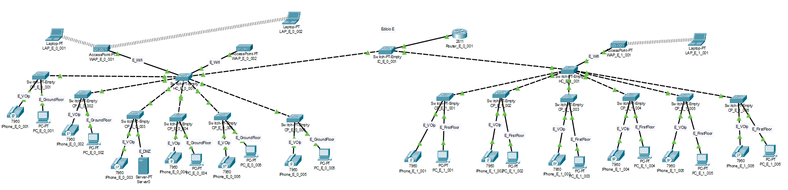

RCOMP 2019-2020 Project - Sprint 2 - Member 170894 folder
===========================================

## Layer Two Setup Project

Projeto Realizado por: Francisco Calejo - 1170894

##### Nota:

> Este projeto dá a continuidade ao projeto do Sprint 1 realizado pelo aluno 1170984, foi diminuída a quantidade de cps utilizados contudo o numero de entradas em cada um aumentou, fazendo com que esta diminuição fosse possívelS.

### Projeto do Edifício E

Imagem do projeto relativamente ao Sprint 2.

##### Vlan´s do edificio
-471 E_Ground_Floor
-472 E_Floor_One
-473 E_Wifi_Network
-474 E_Local_Servers
-475 E_VoIP
-para além destas, todas as vlan´s dos edificios do Campus, estão presentes em todos os edificios.

##### Considerações neste projeto

* Neste edifício o IC é representado pelo switch "IC_E_0_001" e os HC são representados pelos switchs "HC_E_0_001", "HC_E_1_001".
* Os restantes switchs representam os CPs do Edifício E.
* Todos os switchs estão a usar o mesmo VTP Domain.
* Os dispositivos colocados (PCs, APs, Server e VoIP) estão ligados aos switchs com a VLANID que representam o seu tipo de ligação (decidido no planning) e existe também 3 Laptops que se encontram ligados cada um a um AP.
* O tipo de cabo utilizado nas ligações entre os dispositivos representam o desenho da estrutura de cabos feita no Sprint 1.
