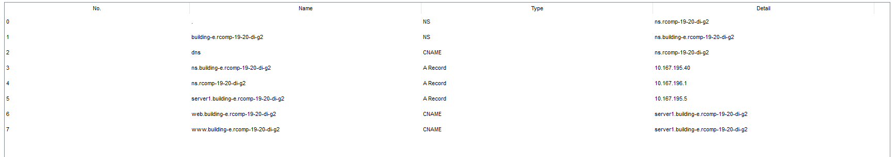

RCOMP 2019-2020 Project - Sprint 3 - Member 1181056 folder
===========================================

## Building E ##

### OSPF (Open Shortest Path First) dynamic routing ###

As routers estáticas criadas no sprint anterior precisam ser excluídos.

Depois de excluídos, podemos criar a área ospf neste edifício.
O edifício E terá o ID do processo 5, o edifício D terá o ID 4, etc.
Portanto, este edifício terá id = 5 e sua área terá id 5 pelo mesmo motivo. Também será usada a área 0, que representa a infraestrutura de backbone.

Então, usamos os comandos:

```
router ospf 5
network 10.167.201.1 0.0.0.63 area 5
network 10.167.199.65 0.0.0.63 area 5
network 10.167.198.193 0.0.0.63 area 5
network 10.167.195.1 0.0.0.255 area 5
network 10.167.201.65 0.0.0.63 area 5
network 10.167.196.1 0.0.0.255 area 0
```


### HTTP (HyperTet Transfer Protocol) ###

It will be added to this simulation a new server and define statically its ip. Then we must configure the HTML page in order to identify the building where this HTTP server is stored in.


### DNS (Domain Name System) ###

Tabela DNS:



## DNS client's configuration (end-nodes) ##

Configuração do DCHP

	ip dhcp pool Piso0_E
	network 10.167.201.0 255.255.255.192
	default-router 10.167.201.1
	domain-name building-e.rcomp-19-20-di-g2
	dns-server 10.167.195.40
	exit
	ip dhcp excluded-address 10.167.201.1

	ip dhcp pool Piso1_E
	network 10.167.199.64 255.255.255.192
	default-router 10.167.199.65
	domain-name building-e.rcomp-19-20-di-g2
	dns-server 10.167.195.40
	exit
	ip dhcp excluded-address 10.167.199.65

	ip dhcp pool Wifi_E
	network 10.167.198.192 255.255.255.192
	default-router 10.167.198.193
	domain-name building-e.rcomp-19-20-di-g2
	dns-server 10.167.195.40
	exit
	ip dhcp excluded-address 10.167.198.193

	ip dhcp pool VOIP_E
	network 10.167.201.64 255.255.255.192
	default-router 10.167.201.65
	option 150 ip 10.167.201.65
	exit
	ip dhcp excluded-address 10.167.201.65


### VOIP phones

Para cada switch/interface (1/1) com phones, a seguinte configuração será feita: 

```
int Fa1/1
switchport mode access
switchport voice vlan 475
no switchport access vlan
```

No router do edifício de nivel mais alto (MC no edifício A), o seguinte será feito para o número de telemóveis necessários (neste caso, 3): 

```
telephony-service
auto-reg-ephone
ip source-address 10.167.201.65 port 2000
max-ephones 11
max-dn 11
auto assign 1 to 11
exit
ephone-dn 1
number 5000
ephone-dn 2
number 5001
ephone-dn 3
number 5002
ephone-dn 4
number 5003
ephone-dn 5
number 5004
ephone-dn 6
number 5005
ephone-dn 7
number 5006
ephone-dn 8
number 5007
ephone-dn 9
number 5008
ephone-dn 10
number 5009
ephone-dn 11
number 5010

```


### NAT (Network Address Translation ###

Para a configuração do NAT, fizemos o seguinte: 

interface FastEthernet0/0.1
ip nat inside
interface FastEthernet0/0.6
ip nat outside
no access-list 1
access-list 1 permit 10.167.195.0
ip nat inside source list 1 interface FastEthernet0/0.1 overload
ip nat inside source static tcp 10.167.195.5 80 10.167.196.4 80

interface FastEthernet0/0.1
ip nat inside
interface FastEthernet0/0.6
ip nat outside
no access-list 1
access-list 1 permit 10.167.195.0
ip nat inside source list 1 interface FastEthernet0/0.1 overload
ip nat inside source static tcp 10.167.195.5 443 10.167.196.4 443

interface FastEthernet0/0.1
ip nat inside
interface FastEthernet0/0.6
ip nat outside
no access-list 1
access-list 1 permit 10.167.195.0
ip nat inside source list 1 interface FastEthernet0/0.1 overload
ip nat inside source static tcp 10.167.195.40 53 10.167.196.4 53

interface FastEthernet0/0.2
ip nat inside
interface FastEthernet0/0.6
ip nat outside
no access-list 2
access-list 2 permit 10.167.195.0
ip nat inside source list 2 interface FastEthernet0/0.1 overload
ip nat inside source static tcp 10.167.195.5 80 10.167.196.4 80

interface FastEthernet0/0.2
ip nat inside
interface FastEthernet0/0.6
ip nat outside
no access-list 2
access-list 2 permit 10.167.195.0
ip nat inside source list 2 interface FastEthernet0/0.1 overload
ip nat inside source static tcp 10.167.195.5 443 10.167.196.4 443

interface FastEthernet0/0.2
ip nat inside
interface FastEthernet0/0.6
ip nat outside
no access-list 2
access-list 2 permit 10.167.195.0
ip nat inside source list 2 interface FastEthernet0/0.1 overload
ip nat inside source static tcp 10.167.195.40 53 10.167.196.4 53

interface FastEthernet0/0.3
ip nat inside
interface FastEthernet0/0.6
ip nat outside
no access-list 3
access-list 3 permit 10.167.195.0
ip nat inside source list 3 interface FastEthernet0/0.1 overload
ip nat inside source static tcp 10.167.195.5 80 10.167.196.4 80

interface FastEthernet0/0.3
ip nat inside
interface FastEthernet0/0.6
ip nat outside
no access-list 3
access-list 3 permit 10.167.195.0
ip nat inside source list 3 interface FastEthernet0/0.1 overload
ip nat inside source static tcp 10.167.195.5 443 10.167.196.4 443

interface FastEthernet0/0.3
ip nat inside
interface FastEthernet0/0.6
ip nat outside
no access-list 3
access-list 3 permit 10.167.195.0
ip nat inside source list 3 interface FastEthernet0/0.1 overload
ip nat inside source static tcp 10.167.195.40 53 10.167.196.4 53

interface FastEthernet0/0.4
ip nat inside
interface FastEthernet0/0.6
ip nat outside
no access-list 4
access-list 4 permit 10.167.195.0
ip nat inside source list 4 interface FastEthernet0/0.1 overload
ip nat inside source static tcp 10.167.195.5 80 10.167.196.4 80

interface FastEthernet0/0.4
ip nat inside
interface FastEthernet0/0.6
ip nat outside
no access-list 4
access-list 4 permit 10.167.195.0
ip nat inside source list 4 interface FastEthernet0/0.1 overload
ip nat inside source static tcp 10.167.195.5 443 10.167.196.4 443

interface FastEthernet0/0.4
ip nat inside
interface FastEthernet0/0.6
ip nat outside
no access-list 4
access-list 4 permit 10.167.195.0
ip nat inside source list 4 interface FastEthernet0/0.1 overload 
ip nat inside source static tcp 10.167.195.40 53 10.167.196.4 53

interface FastEthernet0/0.5
ip nat inside
interface FastEthernet0/0.6
ip nat outside
no access-list 5
access-list 5 permit 10.167.195.0
ip nat inside source list 5 interface FastEthernet0/0.1 overload 
ip nat inside source static tcp 10.167.195.5 80 10.167.196.4 80

interface FastEthernet0/0.5
ip nat inside
interface FastEthernet0/0.6
ip nat outside
no access-list 5
access-list 5 permit 10.167.195.0
ip nat inside source list 5 interface FastEthernet0/0.1 overload
ip nat inside source static tcp 10.167.195.5 443 10.167.196.4 443

interface FastEthernet0/0.5
ip nat inside
interface FastEthernet0/0.6
ip nat outside
no access-list 5
access-list 5 permit 10.167.195.0
ip nat inside source list 5 interface FastEthernet0/0.1 overload 
ip nat inside source static tcp 10.167.195.40 53 10.167.196.4 53


##### Port Numbers #####

* 53 - DNS
* 80 - HTTP
* 443 - HTTPS


### ACLs (Access Control Lists) ###

Antes de tudo, garantimos que não temos nenhuma lista de acesso configurada (100-105):
sem lista de acesso 100.

Para os firewalls, precisaremos de 6 listas de acesso: uma para o andar0 (100), uma para o andar1 (101), para o wifi (102), para o DMZ (105), VOIp (103) e uma para fora do prédio (104) ).

## For the internal connection ##

Os comandos seguintes vão garantir:
 * bloqueio do Internal Spoofing;
 * permitir todos os ICMP echo requests e echo replies;
 * permitir todo o trafico do DMZ, bloquear todo o tráfego direcionado ao router, exceto o tráfego necessário para os recursos atuais funcionarem (regras estáticas DHCP, TFTP, ITS, OSPF, NAT);

Para as configurações pedidas, o seguinte foi feito:

	FLOOR0:
		- access-list 100 permit ip host 0.0.0.0 host 255.255.255.255					
		- access-list 100 permit ip 10.166.213.0 0.0.0.63 any
						//network FLOOR0 e wildcard
	
	FLOOR1:
		- access-list 101 permit ip host 0.0.0.0 host 255.255.255.255
		- access-list 101 permit ip 10.166.212.128 0.0.0.127 any
					//network FLOOR1 e wildcard
	
	WIFI:
		- access-list 102 permit ip host 0.0.0.0 host 255.255.255.255
		- access-list 102 permit ip 10.166.212.0 0.0.0.127 any
						//network WIFI e wildcard
	
	DMZ:
		- access-list 105 deny ip 10.166.213.128 0.0.0.15 any
					//network WIFI e wildcard
		- access-list 105 permit udp any host 10.166.213.129 eq 53
		- access-list 105 permit tcp any host 10.166.213.129 eq 53
						//IP Servidor DNS
		- access-list 105 permit tcp any host 10.166.213.131 eq 80
		- access-list 105 permit tcp any host 10.166.213.131 eq 443
						//IP Servidor HTTP
	
	VOIP:
		- access-list 103 permit ip host 0.0.0.0 host 255.255.255.255
		- access-list 103 permit udp 10.166.213.64 0.0.0.63 host 10.166.216.3 eq 69
		- access-list 103 permit tcp 10.166.213.64 0.0.0.63 host 10.166.216.3 eq 2000
					//network WIFI e wildcard      //ip da interface BACKBONE do router
		- access-list 103 permit ip 10.166.213.64 0.0.0.63 any

## For the external connection: ##

The following commands will ensure:
 * bloqueio do Internal Spoofing;
 * permitir todos os ICMP echo requests e echo replies;
 * bloquear todo o trafico do DMZ;
 * bloquear todo o tráfego direcionado ao router, exceto o tráfego necessário para os recursos atuais funcionarem (regras estáticas DHCP, TFTP, ITS, OSPF, NAT);

For the access-list 104, which represents the outside:

    BACKBONE:
    	- access-list 104 deny ip 10.166.212.0 0.0.1.255 any
    				 //network do edificio inteiro e wildcard	
    	- access-list 104 permit ospf any host 10.166.216.3
    	- access-list 104 permit udp any host 10.166.216.3 eq 53
    	- access-list 104 permit tcp any host 10.166.216.3 eq 53
    	- access-list 104 permit tcp any host 10.166.216.3 eq 80
    	- access-list 104 permit tcp any host 10.166.216.3 eq 443
    	- access-list 104 permit tcp any host 10.166.216.3 eq 2000
    	- access-list 104 deny ip any host 10.166.216.3
    					 //ip da interface BACKBONE do router
    	- access-list 104 permit ip any any
Para agrupar as access-lists fizemos no final o seguinte: 

```
interface FastEthernet0/0.1 (	CORRESPONDE AO MEU FLOOR0)
 ip access-group 100 in
!
interface FastEthernet0/0.2 (	CORRESPONDE AO MEU FLOOR1)
 ip access-group 101 in
!
interface FastEthernet0/0.3 (	CORRESPONDE AO MEU WIFI)
 ip access-group 102 in
!
interface FastEthernet0/0.4	(CORRESPONDE AO MEU DMZ)
 ip access-group 105 out
!
interface FastEthernet0/0.5	(CORRESPONDE AO MEU VOIP)
 ip access-group 103 in
!
interface FastEthernet0/0.6	(CORRESPONDE AO MEU BACKBONE)
 ip access-group 104 in
```

